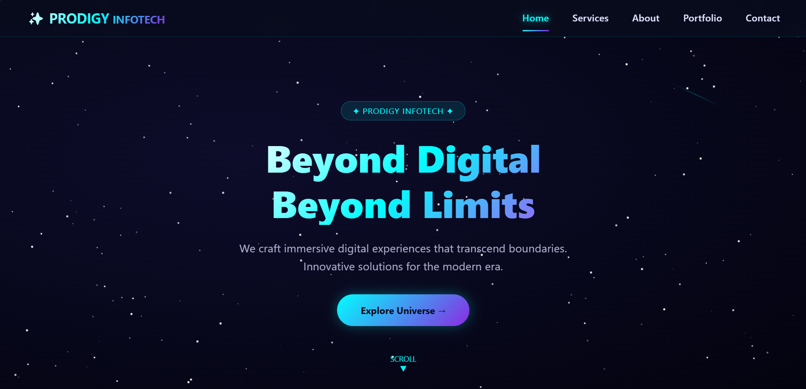

# PRODIGY_WD_01 - Interactive Navigation Menu

## 📌 Task 01
Create an interactive navigation menu that changes color or style when scrolled or when hovering over a menu item.

## 📸 Screenshots

### 1. Normal State (At Top of Page)

*Menu shows BLUE background at top of page*

### 2. Scrolled State (After Scrolling Down)

*Menu changes to BLUE after scrolling*

### 3. Hover Effect

*Menu item turns BLUE when mouse hovers*

### 4. Mobile Responsive View

*Hamburger menu on mobile devices*

## ✅ Features Implemented
- **Fixed Position** - Menu stays visible on all sections
- **Scroll Effect** - Menu changes from Blue to Red when scrolled
- **Hover Effect** - Menu items turn Yellow with Dark Blue text on hover
- **Responsive Design** - Hamburger menu appears on mobile devices
- **Smooth Scrolling** - Click links to smoothly navigate to sections

## 🎯 How to Test

| Feature | Action | Result |
|---------|--------|--------|
| Scroll Effect | Scroll down page | Menu changes to RED |
| Hover Effect | Mouse over any menu item | Background turns YELLOW |
| Mobile Menu | Shrink browser to mobile size | Hamburger icon appears |

## 🛠️ Technologies Used
- HTML5
- CSS3  
- JavaScript

## 🚀 Live Demo
[View Live Demo](https://chaithanya8861.github.io/PRODIGY_WD_01/)

## 📱 How to Run Locally
1. Download `index.html`
2. Double-click to open in any browser
3. No installation required

## 🎨 Color Scheme

| State | Background | Text Color |
|-------|------------|------------|
| Normal | Dark Blue (#2c3e50) | White |
| Scrolled | Red (#e74c3c) | White |
| Hover | Yellow (#f1c40f) | Dark Blue |

## 👨‍💻 Author
**Chaithanya** - Web Development Intern  
PRODIGY INFOTECH
